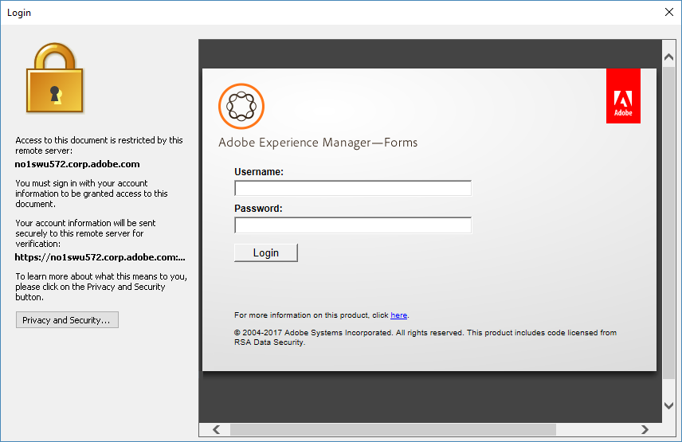

# Utiliser AEM Document Security Extension for Microsoft® Office{#using-aem-document-security-extension-for-microsoft-office}

## Protection des fichiers avec AEM Document Security Extension {#usingaemdocumentsecurityextensiontoprotectfiles}

Vous pouvez contrôler l’utilisation que font les destinataires de vos fichiers protégés, quelle que soit la portée de leur diffusion.

À l’aide de Document Security Extension for Microsoft® Office, vous pouvez effectuer les tâches suivantes :

* Configuration de la connexion à Document Security
* Application d’une politique à un fichier
* Ouvrez les pages Web Document Security pour créer et gérer des stratégies utilisateur.
* Suppression de la protection de politique d’un fichier
* Changement de la politique appliquée à un fichier
* Ouvrez les pages Web Document Security pour révoquer l’accès aux fichiers ou modifier la stratégie du fichier.
* Ouvrez les pages Web Document Security pour afficher l’historique d’audit du fichier.

### Connexion à un serveur Document Security {#connect-to-a-document-security-server}

Si vous souhaitez appliquer des stratégies à des fichiers, vous devez configurer les paramètres de connexion à Document Security. Selon la manière dont Document Security Extension for Microsoft® Office est installé, vous disposez peut-être déjà de paramètres de connexion par défaut. Vous pouvez ajouter des paramètres de connexion pour une ou plusieurs instances de Document Security. Il est possible d’obtenir des informations sur le serveur auprès de l’administrateur de Document Security.

Définissez le serveur à utiliser pour protéger les fichiers ou gérer vos fichiers protégés comme serveur par défaut. Lorsque vous appliquez une stratégie à un nouveau fichier ou ouvrez les pages Web Document Security, Document Security Extension for Microsoft® Office se connecte au serveur par défaut. Si vous protégez des fichiers à l’aide de plusieurs instances de Document Security, vous devez modifier le paramètre de serveur par défaut lorsque vous passez d’un serveur à l’autre. Vous pouvez ouvrir des fichiers protégés par toute instance de Document Security tant que vous disposez de l’autorisation d’ouvrir un fichier.

Si votre serveur Document Security utilise une authentification par certificat, vous devez installer le certificat que vous avez reçu sur votre ordinateur local. Vous devez choisir une authentification de certificat et fournir le certificat que vous souhaitez utiliser pour l’authentification.

Après avoir configuré les paramètres de connexion d’une instance de Document Security dans une application Microsoft® Office, elle est configurée pour Word, Excel et PowerPoint.

#### Installer le certificat côté client {#install-the-client-side-certificate}

Si vous devez accéder aux pages web de Document Security par authentification de certificat ou authentification bidirectionnelle, vous recevrez le certificat que vous devez installer sur votre ordinateur local. Vous recevez un fichier de certificat (fichier .PFX ou .P12) et son mot de passe.

1. Enregistrez le fichier de certificat sur l’ordinateur local.
1. Double-cliquez sur le fichier de certificat pour ouvrir l’assistant d’import de certificat, puis cliquez sur **Suivant**.
1. Cliquez sur **Suivant** si le fichier de certificat est répertorié dans la zone Nom de fichier. Cliquez sur **Parcourir** si vous souhaitez localiser un autre certificat.
1. Saisissez le mot de passe que vous avez reçu et cliquez sur **Suivant**.
1. Dans la boîte de dialogue Magasin de certificats, sélectionnez Placer tous les certificats dans le magasin suivant, puis cliquez sur **Parcourir**.
1. Dans la boîte de dialogue Sélectionner le magasin de certificats, sélectionnez Personnel, cliquez sur **OK**, sur **Suivant**, puis sur **Terminer**.

#### Configurer les paramètres de connexion {#configure-connection-settings}

1. Dans Document Security Extension for Microsoft® Office 2010 et Office 2013, dans l’onglet **Document Security**, choisissez **Sélectionner un serveur**.
1. Cliquez sur **Nouveau** pour créer de nouveaux paramètres de connexion ou sélectionnez une connexion existante et cliquez sur **Modifier**.
1. Tapez un nom de connexion dans la zone **Nom**. Vous pouvez utiliser n’importe quel nom.
1. Tapez l’adresse du serveur dans la zone **Adresse du serveur**.
1. Saisissez le port du serveur dans la zone **Port**.
1. (Facultatif) Si vous souhaitez mémoriser votre nom d’utilisateur et votre mot de passe, sélectionnez **Mémoriser le mot de passe sur cet ordinateur** et saisissez votre nom d’utilisateur et votre mot de passe dans les zones appropriées. Il est recommandé de ne pas sélectionner cette option si d’autres personnes peuvent avoir accès à l’ordinateur.
1. Cliquez sur **Se connecter à ce serveur**. Document Security Extension for Microsoft® Office tente de se connecter au serveur que vous avez spécifié. Selon le type d’authentification spécifié, effectuez l’une des opérations suivantes :

   **Nom d’utilisateur et mot de passe**

   Saisissez le nom d’utilisateur et le mot de passe reçus de l’administration de Document Security.

   **Authentification par certificat**

   Choisissez cette option pour sélectionner le certificat que vous avez reçu et installé dans votre magasin de certificats personnel.

   Si un seul type d’authentification est configuré pour Document Security, seule cette option s’affiche.

>[!NOTE]
>
>Si vous ne pouvez pas vous connecter au serveur, essayez d’ouvrir les pages Web Document Security dans Internet Explorer. Si vous ne pouvez pas vous connecter au serveur à l’aide d’Internet Explorer ou si une boîte de dialogue affiche un avertissement concernant le certificat du serveur, Document Security Extension for Microsoft® Office ne peut pas se connecter au serveur. Contactez l’administration du serveur pour obtenir de l’aide.

>[!NOTE]
>
>Si vous ne pouvez pas vous connecter à Document Security, un message s’affiche indiquant que &quot;le nom d’utilisateur et le mot de passe sont incorrects, vérifiez vos paramètres de configuration et réessayez.&quot; Ce message peut s’afficher si vous ne pouvez pas vous connecter pour une autre raison. Si vous vous connectiez au serveur pour la première fois, vérifiez que vous avez correctement défini le nom et le port du serveur.

#### Spécifiez le serveur par défaut {#specify-the-default-server}

1. Procédez comme suit :

   * Dans Document Security Extension for Microsoft® Office 2010 et Office 2013, dans l’onglet **Document Security**, choisissez **Sélectionner un serveur**.

1. Sélectionnez un serveur défini par défaut, puis cliquez sur **Définir la valeur par défaut**. Une étoile apparaît en regard du serveur par défaut.

### Utilisation de fournisseurs d’authentification tiers {#using-third-party-authentication-providers}

Vous pouvez utiliser des fournisseurs d’authentification tiers avec AEM Forms Document Security. Ces fournisseurs d’authentification vous permettent d’ajouter un niveau d’accès supplémentaire aux documents protégés. AEM Forms Document Security prend en charge les processus d’authentification étendue suivants :

* Authentification étendue à l’aide de l’URL AEM Forms par défaut
* Authentification étendue à l’aide d’une URL personnalisée
* Workflow d’authentification étendue par défaut avec les fournisseurs tiers d’identité configurés sur le serveur JEE d’AEM Forms
* Workflow d’authentification étendue personnalisé avec les fournisseurs tiers d’identité configurés sur le serveur JEE d’AEM Forms
* Authentification étendue à l’aide d’une page personnalisée pour répertorier les authentifications SAML

#### Authentification étendue à l’aide de l’URL d’AEM Forms par défaut {#extended-authentication-using-default-aem-forms-url}

Vous pouvez utiliser l’URL AEM Forms par défaut pour l’authentification étendue. La page de destination par défaut contient l’identité graphique d’Adobe. De plus, les paramètres AEM Forms par défaut sont utilisés lors de l’utilisation de l’URL AEM Forms par défaut pour l’authentification étendue.

Effectuez la procédure suivante pour activer l’authentification étendue à l’aide de l’URL d’accueil Adobe par défaut :

1. Ouvrez l’interface utilisateur d’administration d’AEM Forms.
1. Accédez à Services > Document Security > Configuration > Configuration du serveur.
1. Activez l’option Autoriser l’authentification étendue.
1. Indiquez l’URL d’accueil par défaut de l’authentification étendue. L’URL par défaut est http://localhost:8080/edc/extendedauthentication/welcome.jsp.

   Cliquez sur **[!UICONTROL Enregistrer]**.

   >[!NOTE]
   >
   >Utilisez un nom d’hôte qualifié complet dans l’URL. Adobe recommande d’utiliser le protocole HTTPS.

   Désormais, AEM Forms Document Security est configuré pour utiliser l’authentification étendue avec l’URL d’entrée AEM Forms par défaut.

   

#### Authentification étendue avec une URL d’accueil personnalisée {#extended-authentication-with-a-custom-landing-url}

Vous pouvez indiquer une URL personnalisée pour l’authentification étendue. Vous pouvez ainsi afficher une page d’authentification personnalisée reflétant votre stratégie de marque. Par exemple, les logos, polices et couleurs associés à votre organisation.

Vous pouvez inclure la page d’authentification personnalisée dans un fichier war et déployer le fichier war sur le serveur AEM Forms. Le fichier war contient une logique complète pour accepter les informations d’identification des utilisateurs et utilisatrices et les authentifier sur le serveur AEM Forms. La page d’authentification personnalisée pour Document Security d’AEM Forms doit répondre aux spécifications suivantes :

* La page d’authentification doit envoyer le nom d’utilisateur sous la forme « j_nomd’utilisateur » et le mot de passe sous la forme « j_motdepasse ». La page doit également envoyer « source_url » et « login_url » en tant que paramètres masqués.
* Une fois l’authentification réussie, la page doit se fermer automatiquement.

Pour activer l’authentification étendue avec une URL d’accueil personnalisée :

1. Déployez le fichier WAR d’authentification personnalisé sur le serveur AEM Forms.
1. Ouvrez l’interface utilisateur d’administration d’AEM Forms.
1. Accédez à Services > Document Security > Configuration > Configuration du serveur.
1. Activez l’option Autoriser l’authentification étendue et spécifiez une URL d’entrée d’authentification étendue personnalisée.
1. Ajoutez les entrées suivantes au fichier `config.xml` sous le noeud SSO après l’entrée *&lt;node name=&quot;AllowedUrls&quot;>* :

   >[!NOTE]
   >
   >&lt;entry key=&quot;sso-l&quot; value=&quot;/ sample_/login.jsp&quot;/>`!!discoiqbr!!`&lt;entry key=&quot;sso-s&quot; value=&quot;/ sample_/welcome.jsp&quot;>`!!discoiqbr!!`&lt;entry key=&quot;sso-o&quot; value=&quot;/ sample_/logout.jsp&quot;/>`!!discoiqbr!!`

   Pour suivre la procédure de mise à jour du fichier config.xml, consultez la section [Modifier manuellement le fichier de configuration de Document Security](https://experienceleague.adobe.com/en/docs/experience-manager-release-information/aem-release-updates/previous-updates/aem-previous-versions#manually_editing_the_document_security_configuration_file).

   Document Security d’AEM Forms est désormais configuré pour utiliser l’authentification étendue à l’aide d’une URL d’accueil AEM Forms par défaut.

#### Processus d’authentification étendue par défaut avec les fournisseurs tiers d’identité configurés sur le serveur AEM Forms {#default-extended-authentication-workflow-with-third-party-identity-providers-configured-on-aem-forms-server}

L’authentification étendue peut utiliser différents types d’authentification disponibles sur le serveur AEM Forms. Par exemple, SAML, ou [d’autres exemples].

Remarque : si les fournisseurs SAML sont configurés sur le serveur AEM Forms, une page contenant tous les fournisseurs d’identité configurés pour les authentifications SAML s’affiche avant d’afficher l’URL de destination.

L’écran suivant s’affiche lorsqu’un document protégé est ouvert dans Acrobat.

#### Processus d’authentification étendue personnalisée lorsque les fournisseurs SAML sont configurés sur le serveur AEM Forms {#custom-extended-authentication-workflow-when-saml-providers-are-configured-on-aem-forms-server}

Si les fournisseurs SAML sont configurés sur le serveur AEM Forms, une page contenant tous les fournisseurs d’identité configurés pour les authentifications SAML s’affiche avant d’afficher l’URL de destination.

Les conditions préalables à la configuration d’un processus d’authentification étendue personnalisée lorsque les fournisseurs SAML sont configurés sur le serveur AEM Forms sont :

* Les authentifications SAML sont configurées sur le serveur AEM Forms.
* Le fichier war personnalisé, contenant une page d’authentification personnalisée et une logique complète pour accepter les informations d’identification des utilisateurs et utilisatrices et les authentifier sur le serveur AEM Forms, est déployé sur le serveur AEM Forms.

#### Utiliser une page personnalisée pour répertorier les authentifications SAML {#using-custom-page-for-listing-saml-authentications}

Vous pouvez également afficher une page personnalisée pour inclure tous les fournisseurs d’authentification configurés sur le serveur AEM Forms. Pour créer une telle page :

1. Incluez la page d’authentification personnalisée dans un fichier war et déployez le fichier war sur le serveur AEM Forms. Le fichier war contient une logique complète pour accepter les informations d’identification des utilisateurs et utilisatrices et les authentifier sur le serveur AEM Forms.
1. Ouvrez l’interface d’administration d’AEM Forms et accédez à **[!UICONTROL Paramètres]** > **[!UICONTROL Gestion des utilisateurs]** > **[!UICONTROL Configuration]** > **[!UICONTROL Paramètres du fournisseur de services SAML]**.
1. Ajoutez l’élément suivant au champ Propriétés personnalisées et cliquez sur **[!UICONTROL Enregistrer]**.

   *saml.sp.discovery.url=/demoJSP/saml_discovery.jsp*

   Désormais, AEM Forms Document Security est configuré pour afficher une page personnalisée contenant tous les fournisseurs d’authentification configurés.

### Obtention d’un compte d’utilisateur {#obtaining-a-user-account}

Si vous n’avez pas encore de compte Document Security, Document Security peut lancer le processus d’enregistrement lorsque les événements suivants se produisent :

* Un utilisateur de Document Security qui souhaite vous envoyer un fichier protégé par une politique vous ajoute à une politique.
* Un administrateur de Document Security vous crée un compte.

Une fois votre compte enregistré et activé, vous pouvez utiliser des fichiers protégés par une stratégie que vous avez reçu l’autorisation d’utiliser par le biais d’une stratégie.

>[!NOTE]
>
>Si vous recevez un fichier protégé par une stratégie et que vous ne disposez pas d’un compte Document Security, contactez la personne qui vous a envoyé le fichier pour obtenir de l’aide. De même, si vous recevez une invitation à vous enregistrer, contactez l’expéditeur pour obtenir de l’aide.

Si vous recevez une invitation à vous enregistrer par email à l’aide de Document Security, vous pouvez vous enregistrer à l’aide de l’URL indiquée pour ouvrir la page d’enregistrement en ligne. Une fois votre enregistrement effectué, vous recevez un deuxième avis sur l’activation de votre compte.

#### Obtention d’un compte d’utilisateur externe {#obtain-an-external-user-account}

1. Ouvrez l’email d’inscription de Document Security. L’URL contenue dans le message est un lien vers la page d’enregistrement des utilisateurs externes de Document Security. Si vous ne recevez pas de message d’enregistrement, contactez la personne qui vous a adressé le dossier pour obtenir de l’aide.
1. Cliquez sur l’URL ou copiez-la et collez-la dans votre navigateur.
1. Entrez votre nom, votre organisation et votre mot de passe dans les zones appropriées. Votre mot de passe peut constituer n’importe quelle combinaison de huit caractères.

   >[!NOTE]
   >
   >Veillez à choisir un mot de passe facile à retenir ; aucune méthode n’est proposée pour rechercher des mots de passe oubliés.

1. Cliquez sur **Enregistrer**. Un message s’affiche pour vous demander de vérifier votre adresse électronique en vue d’envoyer un email d’activation.
1. Ouvrez l’email de confirmation d’enregistrement de Document Security.
1. Cliquez sur l’URL qui apparaît dans le message.
1. Cliquez sur le lien vers la page Ouverture de session.
1. Dans la zone **Nom d’utilisateur**, saisissez l’adresse électronique sous laquelle vous êtes enregistré auprès de Document Security. Cette adresse correspond à votre nom d’utilisateur Document Security par défaut.
1. Dans le champ **Mot de passe**, saisissez le mot de passe créé lors de votre enregistrement.
1. Cliquez sur **Ouverture de session**.

### Création et gestion des politiques {#creating-and-managing-policies}

Si vous disposez de l’autorisation de l’administrateur Document Security, vous pouvez créer des politiques applicables à vos propres fichiers dans la page Politiques des pages web de Document Security.

Certains des paramètres disponibles pour la création de politiques dans les pages web de Document Security ne sont pas pris en charge pour les fichiers Word, Excel et PowerPoint. Les tableaux suivants décrivent les correspondances des autorisations de politique avec les fonctionnalités Word, Excel et PowerPoint.

<table>
 <thead>
  <tr>
   <th>
Autorisations
</th>
   <th>
Prise en charge de Word, Excel et PowerPoint
</th>
  </tr>
 </thead>
 <tbody>
  <tr>
   <td>
Imprimer &gt; Non autorisé
</td>
   <td>
L’impression du fichier n’est pas autorisée.
</td>
  </tr>
  <tr>
   <td>
Imprimer &gt; Autorisé
</td>
   <td>
L’impression du fichier est autorisée.

<strong>Remarque</strong> : <i>Si une politique autorise la copie, mais pas l’impression, il est possible d’imprimer le contenu copié dans un autre fichier.</i>
</td>
  </tr>
  <tr>
   <td>
Imprimer &gt; Basse résolution uniquement
</td>
   <td>
Non applicable.
</td>
  </tr>
  <tr>
   <td>
Modifier &gt; Tout
</td>
   <td>
Le fichier peut être modifié.

Lorsque cette autorisation n’est pas accordée, vous ne pouvez pas modifier les fichiers Word et Excel protégés. Vous pouvez modifier des fichiers PowerPoint, mais vous ne pouvez pas enregistrer les modifications ou afficher les diaporamas pour les fichiers modifiés.
</td>
  </tr>
  <tr>
   <td>
Modifier &gt; Non autorisé
</td>
   <td>
Les utilisateurs ne peuvent pas modifier les fichiers protégés.
</td>
  </tr>
  <tr>
   <td>
Modifier &gt; Modifier les pages
</td>
   <td>
Non applicable.

Il comprend l’insertion, la suppression et la rotation de pages.
</td>
  </tr>
  <tr>
   <td>
Modifier &gt; Remplir et signer
</td>
   <td>
Non applicable.
</td>
  </tr>
  <tr>
   <td>
Hors connexion
</td>
   <td>
Le fichier peut être ouvert hors connexion.
</td>
  </tr>
  <tr>
   <td>
Copier
</td>
   <td>
Le contenu du fichier peut être copié dans d’autres fichiers.
</td>
  </tr>
  <tr>
   <td>
Lecteur d’écran 
</td>
   <td>
Les lecteurs d’écran (appareils pour les utilisateurs atteints de déficience visuelle) peuvent lire le contenu du fichier.
</td>
  </tr>
  <tr>
   <td>
Validité des droits
</td>
   <td>
Pris en charge.
</td>
  </tr>
 </tbody>
</table>

<table>
 <thead>
  <tr>
   <th>
Paramètres généraux
</th>
   <th>
Prise en charge de Word, Excel et PowerPoint
</th>
  </tr>
 </thead>
 <tbody>
  <tr>
   <td>
Période de validité
</td>
   <td>
Pris en charge.
</td>
  </tr>
  <tr>
   <td>
Document d’audit
</td>
   <td>
Pris en charge.
</td>
  </tr>
  <tr>
   <td>
Période d’ouverture hors connexion
</td>
   <td>
Pris en charge.
</td>
  </tr>
  <tr>
   <td>
Fournisseurs d’autorisations externes
</td>
   <td>
Pris en charge.
</td>
  </tr>
 </tbody>
</table>

<table>
 <thead>
  <tr>
   <th>
Paramètres avancés
</th>
   <th>
Prise en charge de Word, Excel et PowerPoint
</th>
  </tr>
 </thead>
 <tbody>
  <tr>
   <td>
Filigranes dynamiques
</td>
   <td>
Pris en charge.
</td>
  </tr>
  <tr>
   <td>
Plug-ins de certification
</td>
   <td>
Non applicable.
</td>
  </tr>
  <tr>
   <td>
Algorithme de chiffrement et longueur des clés 
</td>
   <td>
Toutes les options sont prises en charge.
</td>
  </tr>
  <tr>
   <td>
Restrictions du document
</td>
   <td>
Tous les contenus des fichiers sont toujours chiffrés, quel que soit le paramètre défini dans la politique.
</td>
  </tr>
  <tr>
   <td>
Message d’erreur de refus d’accès
</td>
   <td>
Pris en charge.
</td>
  </tr>
 </tbody>
</table>

Pour plus d’informations sur la création et la gestion des politiques, voir [Aide pour l’utilisateur final de Document Security](https://help.adobe.com/fr_FR/AEMForms/6.1/RMHelp/).

### Application des politiques {#applying-policies}

Vous pouvez appliquer n’importe quelle stratégie disponible à un fichier, y compris les stratégies que vous avez créées et les stratégies qui font partie des jeux de stratégies auxquels vous avez accès. Avant d’appliquer une politique, vous devez enregistrer le fichier.

Une fois une stratégie appliquée, elle est ajoutée à la liste Récemment utilisées du menu AEM Document Security afin de vous permettre d’appliquer plus facilement vos stratégies les plus fréquemment utilisées. La liste Récemment utilisés affiche uniquement les stratégies relatives au serveur auquel vous êtes connecté ou à votre serveur par défaut si vous ne vous êtes pas connecté à une autre instance Document Security.

>[!NOTE]
>
>Les stratégies peuvent uniquement être appliquées aux fichiers Word (.doc, .docx, .docm), Excel (.xls, .xlsx, .xlsm) et PowerPoint (.ppt, .pptx, .pptm) dans Microsoft® Office 2010 et 2013. Vous ne pouvez pas appliquer de stratégies aux fichiers de modèle Word (.dot), aux fichiers de modèle Excel (.xlt) ni aux fichiers de modèle de conception PowerPoint (.pot).

#### Application d’une politique {#apply-a-policy}

1. Dans Document Security Extension for Microsoft® Office 2010 et 2013, dans l’onglet **Document Security**, sélectionnez **Sécuriser > Sélectionner une stratégie**.

   Si vous avez choisi le nom d’utilisateur et le mot de passe comme méthode d’authentification sur le serveur et que vous n’avez pas encore fourni d’informations de connexion à Document Security, une boîte de dialogue vous invite à saisir votre nom d’utilisateur et votre mot de passe.

1. Dans la liste, sélectionnez une politique, puis cliquez sur **Appliquer**.
1. Enregistrez le fichier.

#### Application d’une stratégie récemment utilisée {#apply-a-recently-used-policy}

1. Dans Document Security Extension for Microsoft® Office 2010 et 2013, dans l’onglet **Document Security**, sélectionnez **Sécurisé** > *[Nom de la stratégie]*.
1. Enregistrez le fichier.

## Utilisation des fichiers protégés par une politique {#usingaemdocumentsecurityextensionpolicyprotectedfiles}

L’éditeur du fichier détient la propriété intellectuelle des fichiers protégés par une stratégie, que Document Security protège.

Vous pouvez utiliser des fichiers protégés par une stratégie, que voua apparteniez ou non à l’entreprise de l’éditeur ou de l’éditrice des fichiers. Document Security doit vous reconnaître pour ouvrir des fichiers protégés par une stratégie. Il doit le faire via LDAP/Active Directory. Ou, il doit le faire en tant qu’utilisateur local pour LiveCycle/AEM forms on JEE, ou en s’enregistrant après une invitation.

Si vous recevez un fichier protégé par une stratégie et que vous ne disposez pas d’un compte Document Security, contactez l’expéditeur pour obtenir de l’aide. De même, si vous recevez une invitation à vous enregistrer, contactez l’expéditeur pour obtenir de l’aide.

### Utiliser des fichiers protégés par une stratégie dans Microsoft® Office {#working-with-policy-protected-files-in-microsoft-office}

Document Security Extension for Microsoft® Office limite certaines fonctionnalités de Word, Excel et PowerPoint afin de protéger la propriété intellectuelle de l’éditeur du fichier. Si vous n’êtes pas autorisé à modifier le fichier, vous ne pouvez pas y enregistrer les modifications.

Si vous travaillez avec un fichier protégé par une politique, il se peut que certaines fonctionnalités du produit ne soient pas disponibles ou ne fonctionnent pas comme d’habitude. Si un fichier non protégé est ouvert, la plupart des fonctionnalités sont activées, à l’exception des fonctionnalités qui vous permettent d’importer ou de copier du contenu à partir d’un fichier protégé par une stratégie sans autorisation de copie ou d’exportation.

>[!NOTE]
>
>Lorsque vous utilisez des applications Office prises en charge par Document Security Extension, il est recommandé de désactiver le paramètre Windows DEP. Pour garantir un démarrage fluide des applications Office sur un ordinateur avec Document Security Extension et McAfee VirusScan avec activation de l’option d’analyse lors de l’accès, désactivez l’option de protection contre le débordement de la mémoire tampon dans la console McAfee VirusScan. Cet ajustement permet d&#39;éviter les conflits potentiels.

Si une fonction n’est pas disponible, le nom de la commande dans le menu et le bouton de barre d’outils correspondant ne sont pas disponibles. Dans Document Security Extension for Microsoft® Office, lorsque vous placez le pointeur de la souris sur la commande ou le bouton, une info-bulle indique que la commande n’est pas disponible pour Document Security.

### Ouvrir des fichiers protégés par une stratégie {#opening-policy-protected-files}

Vous pouvez ouvrir des fichiers protégés par une politique en utilisant les mêmes méthodes que celles utilisées pour ouvrir tout autre fichier. Si vous n’étiez pas déjà connecté à Document Security, vous êtes invité à le faire. En d’autres termes, si vous n’êtes pas connecté à Internet et que vous pouvez ouvrir le fichier hors ligne. Si vous annulez le processus de connexion, l’accès est refusé.

Si vous n’avez pas été autorisé à ouvrir le fichier, vous êtes informé que l’accès est refusé. Si les privilèges d’accès aux fichiers ont été révoqués, vous pouvez également être redirigé vers une version mise à jour du fichier si celle-ci est disponible. Pour obtenir une assistance supplémentaire si vous ne pouvez pas ouvrir un fichier protégé par une politique, contactez l’éditeur de fichiers.

Lorsqu’un fichier protégé est ouvert, le texte de la barre de titre qui suit le nom du fichier indique que le fichier est protégé par Document Security d’AEM.

Lors de l’ouverture d’un document protégé dans Document Security Extension for Microsoft® Office à partir de SharePoint Server, assurez-vous que le programme Office associé au type de fichier, tel que Word, Excel ou PowerPoint, est ouvert. Si vous essayez d’ouvrir le fichier sans accéder à l’application associée, le document risque de ne pas s’ouvrir et un message d’erreur indiquant que vous devez installer le plug-in approprié s’affiche. En plus d’ouvrir l’application requise, Adobe vous recommande d’effacer le dossier du cache. Avant d’ouvrir un document protégé dans Document Security Extension for Office à partir du serveur SharePoint. De même, lorsque vous ouvrez un document protégé depuis SharePoint Server, toutes les autorisations du document sont désactivées, quelle que soit la politique appliquée.

Selon la méthode d’authentification mise en œuvre sur Document Security, vous pouvez être invité à choisir la méthode d’authentification lorsque vous ouvrez un document protégé. Si Document Security prend en charge plusieurs méthodes d’authentification, les options d’authentification vous sont présentées. Par exemple, si un serveur Document Security fournit l’authentification par nom d’utilisateur/mot de passe et certificat, vous pouvez choisir la méthode d’authentification appropriée. Si l’authentification par certificat est activée, vous avez été invité à utiliser le certificat que vous avez reçu et installé.

L’expérience de l’utilisateur lors de l’ouverture de fichiers protégés dépend de la configuration de l’authentification mutuelle sur le serveur. Si un seul certificat client valide est installé, aucune boîte de dialogue d’authentification ne s’affiche et les fichiers s’ouvrent correctement. Cependant, si plusieurs certificats clients sont installés sur un ordinateur, une boîte de dialogue d’authentification s’affiche. L’utilisateur doit choisir un certificat valide pour ouvrir le fichier protégé.

### Suppression de la protection de politique d’un fichier {#removing-policy-protection-from-a-file}

Si vous avez été autorisé, vous pouvez supprimer la protection de stratégie des fichiers que vous avez protégés. Dans ce cas, le fichier n’est plus protégé par Document Security.

1. Dans Document Security Extension for Microsoft® Office 2010 et 2013, dans l’onglet **Document Security**, sélectionnez **Supprimer**.

   Si vous n’avez pas encore indiqué d’informations de connexion à Document Security, une boîte de dialogue vous invite à saisir votre nom d’utilisateur et votre mot de passe.

>[!NOTE]
>
>Si vous ne pouvez pas supprimer une politique d’un fichier que vous avez protégé, contactez un administrateur Document Security.

### Affichage des paramètres de protection {#viewing-security-settings}

Vous pouvez afficher les autorisations dont vous disposez pour le fichier en cours d’impression. Vous pouvez également afficher les autorisations du fichier actif lors de la copie, de la modification et de l’accès hors ligne, ainsi que la période de validité du fichier.

Dans Document Security Extension for Microsoft® Office 2010, le groupe État de la sécurité de l’onglet Document Security affiche vos autorisations pour le fichier.

Procédez comme suit :

* Dans Document Security Extension for Microsoft® Office 2010 et 2013, dans l’**onglet Document Security**, sélectionnez un élément dans le groupe **État de la sécurité**.

### Enregistrer des documents lorsque l’application automatique de la stratégie est activée {#saving-documents-when-auto-apply-policy-is-enabled}

Si votre administration a activé la fonctionnalité d’application automatique de la stratégie, tout document créé ou modifié sera automatiquement protégé lors de son enregistrement.

Si la stratégie d’application automatique est activée, Document Security Extension for Microsoft® Office vous invite à vous connecter au serveur Document Security. Saisissez votre nom d’utilisateur et votre mot de passe afin que le serveur puisse vous authentifier. Si vous avez fourni les informations d’identification appropriées, le document est enregistré et protégé.

>[!NOTE]
>
>Si vous ne pouvez pas vous connecter à Document Security, le document peut être enregistré ou non. Cette situation dépend de la manière dont votre administrateur a configuré la stratégie d’application automatique. Vérifiez avec l’administrateur comment les documents sont traités dans cette situation.

### Synchronisation en vue de l’accès hors connexion {#synchronizing-for-offline-access}

Les politiques vous permettent d’ouvrir des fichiers lorsque vous êtes hors ligne et que vous n’êtes pas connecté à Document Security. Vous devez vous être connecté auparavant à Document Security pour établir vos informations d’identification avec le serveur et pouvoir ainsi travailler hors connexion. Si vous envisagez d’utiliser des fichiers hors ligne, Adobe vous recommande de les synchroniser avec Document Security. Avant de vous déconnecter, vérifiez que les paramètres de stratégie de vos fichiers sont à jour avec le serveur. Adobe vous recommande également d’ouvrir le fichier en ligne une fois avant de l’ouvrir hors ligne. Si vous n’ouvrez pas le fichier à une reprise en ligne ou si vous ne le synchronisez pas avec le serveur, il est possible que vous puissiez tout de même utiliser des fichiers protégés par une politique alors que vous êtes hors ligne. Toutefois, la période d’ouverture hors connexion ne doit pas avoir expiré et les paramètres de politique du fichier ne doivent pas avoir été modifiés depuis la dernière synchronisation manuelle ou automatique avec le serveur.

Procédez comme suit :

* Dans Document Security Extension for Microsoft® Office 2010 et 2013, dans l’onglet **Document Security**, sélectionnez **Synchroniser hors ligne**.

  ***Remarque **: le bouton Synchroniser hors ligne est disponible même si l’utilisateur ne dispose pas d’une autorisation hors ligne pour le document. Toutefois, la sélection du bouton ne fait rien.*

### Utilisation des filigranes dynamiques {#working-with-dynamic-watermarks}

Document Security Extension for Microsoft® Office prend en charge l’inclusion de filigranes dynamiques basés sur du texte dans les documents protégés par une stratégie. Un filigrane dynamique peut inclure des informations qui peuvent changer, telles que la date, l’heure, le nom d’utilisateur ou le nom de la politique. Si un utilisateur imprime un fichier protégé par une politique et que ce fichier contient un filigrane dynamique et l’autorisation d’impression, le filigrane s’affiche dans la sortie.

Document Security Extension ne prend pas en charge les fonctionnalités de filigrane enrichies. Les fonctions de filigrane enrichies incluent des filigranes basés sur un PDF, plusieurs éléments dans un filigrane et des options de mise en forme de texte. Elles incluent également la plage de pages.

Vous pouvez créer un filigrane dynamique à l’aide des pages Web de Document Security. Pour plus d’informations, voir [Aide pour l’utilisateur final de Document Security](https://experienceleague.adobe.com/en/docs/experience-manager-65/content/forms/administrator-help/work-with-document-security/document-security).

Document Security Extension for Microsoft® Office prend en charge les fonctionnalités de filigrane suivantes :

<table>
 <thead>
  <tr>
   <th>
Options des filigranes de Document Security
</th>
   <th>
Prise en charge de Word, Excel et PowerPoint
</th>
  </tr>
 </thead>
 <tbody>
  <tr>
   <td>
Nom de la politique
</td>
   <td>
Pris en charge.
</td>
  </tr>
  <tr>
   <td>
Nom du filigrane
</td>
   <td>
Pris en charge.
</td>
  </tr>
  <tr>
   <td>
Utiliser comme arrière-plan
</td>
   <td>
Le comportement d’affichage d’un filigrane dynamique est identique, que vous sélectionniez Utiliser comme arrière-plan ou non.

Dans Word 2010 et 2013, le filigrane dynamique apparaît uniquement dans les vues Mise en page et Aperçu avant impression. 

Pour Excel 2010 et 2013 également, il apparaît dans les vues Aperçu avant impression et Disposition de page.
</td>
  </tr>
  <tr>
   <td>
Position verticale
</td>
   <td>
Pris en charge
</td>
  </tr>
  <tr>
   <td>
Position horizontale
</td>
   <td>
Pris en charge

Dans Excel 2010 et 2013, le positionnement horizontal des filigranes à l’aide de points ne fonctionne pas.
</td>
  </tr>
  <tr>
   <td>
Échelle
</td>
   <td>
Pris en charge
</td>
  </tr>
  <tr>
   <td>
Position
</td>
   <td>
Pris en charge
</td>
  </tr>
  <tr>
   <td>
Opacité
</td>
   <td>
Pris en charge
</td>
  </tr>
 </tbody>
</table>

### Utilisation des pages web de Document Security {#opening-the-document-security-web-pages}

Vous pouvez ouvrir les pages Web Document Security pour créer et mettre à jour vos stratégies utilisateur, ainsi que pour afficher les informations d’état et de contrôle sur vos fichiers protégés par une stratégie. Vous pouvez également utiliser les pages Web Document Security pour modifier des stratégies ou révoquer l’accès à un fichier protégé par une stratégie.

Pour ouvrir les pages web Document Security, dans Document Security Extension for Microsoft® Office 2010 et 2013, dans l’onglet **Document Security**, sélectionnez **Créer et gérer des stratégies**. Si vous n’avez pas encore fourni vos informations de connexion, le navigateur s’ouvre à la page de connexion au serveur.

### Modification des politiques {#changing-policies}

Si vous disposez d’autorisations, généralement en tant qu’administrateur de Document Security ou en tant qu’éditeur de fichiers, vous pouvez ultérieurement appliquer une autre politique à un fichier ou modifier les paramètres de la politique appliquée.

Pour modifier les paramètres d’une stratégie, utilisez les pages Web Document Security.

1. Procédez comme suit :

   * Dans Document Security Extension for Microsoft® Office 2010 ou 2013, dans l’onglet **Document Security**, sélectionnez **Sécuriser > Modifier la sécurité**.

1. Dans la liste, sélectionnez une politique, puis cliquez sur **Appliquer**.

### Révocation des privilèges d’accès aux fichiers {#revoking-file-access-privileges}

Vous pouvez révoquer la capacité d’ouvrir les fichiers que vous avez protégés. Lors de la révocation de l’accès au fichier, vous pouvez spécifier un message lorsque les utilisateurs tentent de l’ouvrir et fournir une URL vers une version mise à jour en cas de remplacement de celle-ci par une copie révisée.

1. Procédez comme suit :

   * Dans Document Security Extension for Microsoft® Office 2010 et 2013, dans l’onglet **Document Security**, sélectionnez **Révoquer**.

   Les pages Web Document Security s’ouvrent sur la page Révoquer les documents .

1. Spécifiez un message à afficher et, le cas échéant, une URL pour la version mise à jour. Cliquez ensuite sur **OK**.

Pour plus d’informations sur la révocation des privilèges d’accès aux fichiers, consultez la section [Guide de l’utilisateur final de Document Security](https://help.adobe.com/fr_FR/AEMForms/6.1/RMHelp/).

Les privilèges d’accès peuvent être rétablis via les pages Web de Document Security.

### Affichage de l’historique d’audit des fichiers {#viewing-the-file-audit-history}

Document Security peut enregistrer l’historique des audits pour les fichiers protégés par une politique afin que vous puissiez contrôler les actions des utilisateurs sur vos fichiers.

Les événements contrôlés pour les fichiers Word, Excel et PowerPoint sont les suivants :

**Sécurisation d’un nouveau document** Politique appliquée à un fichier

**Affichage d’un document** Fichier ouvert

**Fermeture d’un document** Fichier fermé

**Révocation d’un document** Privilèges d’accès supprimés pour le fichier

**Annulation de la révocation du document** Privilèges d’accès renvoyés au fichier

**Modification du document** Fichier modifié et enregistré localement

**Impression en haute résolution** Fichier imprimé

**Gestionnaire de modification de la protection** Protection de la politique supprimée du fichier

**Changement de politique concernant le document** Nouvelle politique appliquée au fichier à partir des pages web Document Security

### Affichage de l’historique des contrôles d’un fichier {#view-the-audit-history-for-a-file}

Dans Document Security Extension for Microsoft® Office 2010 et 2013, dans l’onglet **Document Security**, sélectionnez **Historique des contrôles**.

Les pages Web Document Security s’ouvrent sur la page Événements, qui affiche les événements contrôlés pour le fichier actif.

### Fonctionnalités restreintes dans Microsoft® Office {#microsoft-office-restricted-features}

Pour protéger votre propriété intellectuelle, certaines fonctionnalités de Microsoft® Office ne sont pas disponibles lorsqu’un fichier protégé par une stratégie est ouvert. La liste des fonctionnalités indisponibles dépend des autorisations accordées à l’utilisateur actuel. Certaines fonctionnalités ne sont disponibles que pour un fichier protégé, tandis que d’autres ne le sont que pour tous les fichiers lorsque vous êtes dans une session protégée. En règle générale, vous êtes dans une session protégée entre l’ouverture d’un fichier protégé par une politique et la fermeture de l’application ou l’expiration de la session.

La plupart des politiques accordent des autorisations complètes à l’éditeur de fichiers. Il est possible que d’autres utilisateurs remarquent des restrictions supplémentaires relatives aux fonctions.

Si une fonction n’est pas disponible, le nom de la commande dans le menu et le bouton correspondant de la barre d’outils apparaissent en grisé.

>[!NOTE]
>
>L’application d’une politique à un fichier contenant un lien vers un fichier incorporé n’applique pas la politique au fichier lié. Document Security for Microsoft® Office n’étend pas la protection aux fichiers liés.

* Les fichiers Word, Excel et PowerPoint protégés par une politique ne peuvent pas s’ouvrir dans une fenêtre du navigateur Internet Explorer.
* Les utilisateurs qui n’ont obtenu que l’autorisation Modifier ne peuvent pas copier du contenu dans un fichier issu d’une autre application à l’aide du presse-papiers Windows. Les utilisateurs et utilisatrices peuvent copier du contenu dans des fichiers en activant l’option Presse-papiers de Microsoft® Office.
* L’ouverture d’un fichier protégé par une stratégie dans Microsoft® Office rend la touche d’impression d’écran indisponible jusqu’à ce que vous fermiez l’application ou que la session expire.
* Document Security for Microsoft® Office ne prend pas en charge le protocole WebDAV (Web-based Distributed Authoring and Versioning). Dans la plupart des cas, vous ne pouvez pas ouvrir un fichier protégé par une stratégie depuis un dossier WebDAV. Si vous pouvez ouvrir un fichier protégé par une stratégie, vous n’avez pas l’autorisation d’enregistrer, d’imprimer, de modifier ni de copier ce fichier.

La sécurité générale appliquée aux fichiers protégés par une stratégie comprend les restrictions suivantes :

Au cours d’une session protégée, il est possible que de nombreuses fonctionnalités courantes soient restreintes dans Word, Excel et PowerPoint.

En cas d’ouverture d’un fichier protégé par une stratégie qui ne permet pas à la personne utilisatrice d’apporter des modifications, les commandes qui permettent de modifier le fichier de quelque manière que ce soit ne sont pas disponibles. Seules sont disponibles les commandes qui ouvrent ou créent des documents et modifient les préférences de l’application.

#### Restrictions de Word 2010 et Word 2013 {#word-2010-and-word-2013-restrictions}

Lorsque vous ouvrez un fichier protégé par une stratégie dans Word, les informations de récupération automatique de fichier ne peuvent pas être enregistrées tant que vous ne fermez pas et ne redémarrez pas Word. En outre, les fonctionnalités répertoriées ci-dessous sont restreintes dans les situations suivantes :

**Fichier > Nouveau > Nouveau à partir d’un fichier existant** Disponible, mais il est impossible d’enregistrer les fichiers créés à l’aide de cette commande alors qu’un fichier protégé par une politique est ouvert. Le contenu du nouveau fichier ne peut pas être copié dans un autre fichier.

**Fichier > Enregistrer** Restreinte par l’autorisation Modifier.

**Fichier > Enregistrer sous** Toutes les options sont restreintes par l’autorisation Modifier.

**Fichier > Imprimer** Toutes les options sont restreintes par l’autorisation Impression. Non disponible, sauf si la politique autorise l’impression haute résolution.

**Fichier > Enregistrer et Envoyer** Toutes les options sont indisponibles pendant une session protégée.

**Fichier > Infos > Document Protect > Chiffrer avec mot de passe, Ajouter une signature numérique, Marquer comme final, Restreindre les autorisations par les personnes** Non disponible lors d’une session protégée.

**Fichier > Workflows** Non disponible pendant une session protégée.

***Remarque **: Le démarrage d’un workflow dans Word, Excel et PowerPoint 2010 est uniquement disponible dans les versions Office Professional Plus 2010, Office Enterprise 2010, Office Ultimate 2010 et 2010 autonome.*

**Billet de blog > Publier** Non disponible pendant une session protégée.

**Fichier > Serveur > Menu Tâches du serveur de fichiers** Non disponible pendant une session protégée.

**Accueil > Presse-papiers > Copier** Restreinte par l’autorisation Copier. Si la copie n’est pas autorisée, le contenu copié ne peut pas être collé dans un autre fichier ou dans le presse-papiers d’Office. Le contenu peut être copié dans le fichier protégé si l’utilisateur dispose de l’autorisation de modification.

**Accueil > Presse-papiers > Coller** Restreinte par l’autorisation Modifier.

**Accueil > Presse-papiers > Collage spécial** Restreinte par l’autorisation Modifier.

**Insérer > Texte > Objet** Non disponible pendant une session protégée. Il est impossible d’insérer à tout moment des fichiers protégés par une politique.

**Publipostage** La plupart des options de cet onglet ne sont pas disponibles pendant une session protégée.

**Révision > Vérification > Recherche** Restreinte par l’autorisation Copier. Non disponible si la copie n’est pas autorisée.

**Révision > Vérification > Dictionnaire des synonymes** Restreinte par l’autorisation Copier. Non disponible si la copie n’est pas autorisée.

**Révision > Langue > Traduire > Traduire le document** Activé avec l’autorisation Copier.

**Révision > Langue > Traduire > Traduire le texte sélectionné** Activé avec l’autorisation Copier.

**Révision > Langue > Traduire > Mini-traducteur** Activé avec l’autorisation Copier.

**Révision > Comparer > Comparer** Non disponible pendant une session protégée. Les fichiers protégés par une politique ne peuvent être comparés à aucun moment.

**Révision > Protéger > Bloquer des auteurs** Non disponible pendant une session protégée.

**Révision > Protéger > Restreindre la modification** Non disponible pendant une session protégée.

**Affichage > Macros** L’autorisation Copier limite certaines macros, ce qui les rend indisponibles sauf si la copie est autorisée.

**Modules complémentaires** Ne peuvent pas être ajoutés ni supprimés pendant une session protégée.

**Collaboration en ligne** Non disponible pendant une session protégée.

La stratégie de documents de Principal **Principal et sous-documents** régit les sous-documents lorsque vous les ouvrez dans le document principal. S’ils sont ouverts séparément, les sous-documents ne peuvent pas être imprimés, copiés ni modifiés.

**Refaire la synthèse** Non disponible pendant une session protégée.

**Images (et toutes les commandes associées)** Non disponibles pendant une session protégée.

**Panneau de documents** Non disponible pendant une session protégée.

**Développeur > Modèle de document** Non disponible pendant une session protégée. Pour accéder à cette commande, choisissez Fichier > Options > Personnaliser > Onglet Développeur > Modèles > Modèle de document.

**Contournement > Principal de document > Créer un sous-document, Insérer un sous-document** Non disponible lors d’une session protégée.

#### Restrictions dans Excel 2010 et Excel 2013 {#excel-2010-and-excel-2013-restrictions}

Les fonctionnalités répertoriées ci-dessous sont restreintes dans les situations suivantes :

**Fichier > Nouveau > Nouveau à partir d’un fichier existant** Disponible, mais il est impossible d’enregistrer les fichiers créés à l’aide de cette commande au cours d’une session protégée. Le contenu du nouveau fichier ne peut pas être copié dans un autre fichier.

**Fichier > Enregistrer, Enregistrer sous** Restreinte par l’autorisation Modifier.

**Fichier > Enregistrer sous > PDF** Non disponible pendant une session protégée.

**Fichier > Imprimer** Restreinte par l’autorisation d’impression. Non disponible, sauf si la politique autorise l’impression haute résolution.

**Fichier > Infos > Protéger le document** Non disponible pendant une session protégée.

**Fichier > Infos > Protéger le classeur** Non disponible pendant une session protégée.

**Fichier > Enregistrer et Envoyer** Non disponible pendant une session protégée.

**Fichier > Options > Modules complémentaires** Ne peuvent pas être ajoutés ni supprimés pendant une session protégée.

**Fichier > Workflows** Non disponible pendant une session protégée.

***Remarque **: Le démarrage d’un workflow dans Word, Excel et PowerPoint 2010 est uniquement disponible dans les versions Office Professional Plus 2010, Office Enterprise 2010, Office Ultimate 2010 et 2010 autonome.*

**Fichier > Serveur > Menu Tâches du serveur de fichiers** Non disponible pendant une session protégée.

**Accueil > Presse-papiers > Copier** Restreinte par l’autorisation Copier. Si la copie n’est pas autorisée, le contenu copié ne peut pas être collé dans un autre fichier ou dans le presse-papiers de Microsoft® Office. Le contenu peut être copié dans le fichier protégé si l’utilisateur dispose de l’autorisation de modification.

**Accueil > Presse-papiers > Coller** Restreinte par l’autorisation Modifier.

**Accueil > Presse-papiers > Collage spécial** Restreinte par l’autorisation Modifier.

**Accueil > Cellules > Format > Déplacer ou copier une feuille** Non disponible pendant une session protégée.

**Accueil > Cellules > Insérer > Insérer une feuille** Non disponible pendant une session protégée.

**Accueil > Cellules > Supprimer > Supprimer une feuille** Non disponible pendant une session protégée.

**Accueil > Édition > Remplir > Sur une feuille de calcul** Restreinte par l’autorisation Modifier.

**Insérer > Tableaux > Tableau** Restreinte par l’autorisation Modifier.

**Insérer > Tableaux > Tableaux croisés dynamiques** Il est impossible de sélectionner des fichiers protégés par une politique de tableau dans l’Assistant de création.

**Insérer > Texte > Objet** Non disponible pendant une session protégée. Il est impossible d’insérer à tout moment des fichiers protégés par une politique.

**Insérer > Texte > En-tête et pied de page** Restreinte par l’autorisation Modifier. Non disponible pour un document protégé par une politique.

**Données > Obtenir des données externes** Les données des fichiers protégés par une stratégie ne peuvent pas être importées.

**Données > Plan > Sous-totaux** Restreinte par l’autorisation Modifier.

**Données > Outils de données > Validation des données** Restreinte par l’autorisation Modifier.

**Révision > Vérification > Recherche** Restreinte par l’autorisation Copier.

**Révision > Vérification > Dictionnaire des synonymes** Restreinte par l’autorisation Copier.

**Révision > Langue > Traduire** Restreinte par l’autorisation Copier.

**Révision > Changements > Protéger la feuille** Non disponible pendant une session protégée.

**Révision > Modifications > Protéger le classeur** Non disponible pendant une session protégée.

**Révision > Changements > Partager le classeur** Non disponible pendant une session protégée.

**Révision > Changements > Protéger et partager le classeur** Non disponible pendant une session protégée.

**Révision > Modifications > Permettre aux utilisateurs de modifier des plages** Non disponible pendant une session protégée.

**Révision > Modifications > Suivi des modifications > Mise en surbrillance des modifications** Non disponible pour un fichier protégé par une stratégie contenant un filigrane dynamique.

**Affichage > Macros** Restreinte par l’autorisation Modifier.

**Affichage > Enregistrer l’espace de travail** La commande ne fonctionne pas.

**Développeur > XML > Packs d’extension** L’autorisation Copier limite certaines macros, ce qui les rend indisponibles sauf si vous autorisez la copie.

**Formules > Audit de formules > Vérification des erreurs** Restreinte par l’autorisation Modifier. Non disponible sauf si la modification est autorisée.

**Collaboration en ligne** Non disponible pendant une session protégée.

**Enregistrer les informations de récupération automatique** Indisponible pendant une session protégée.

***Remarque **: si vous tentez de modifier une cellule dans un fichier protégé par une stratégie sans autorisation, Excel vous avertit par erreur d’utiliser la commande Annuler la protection de la feuille pour supprimer la protection.*

#### Restrictions dans PowerPoint 2010 et PowerPoint 2013 {#powerpoint-2010-and-powerpoint-2013-restrictions}

Les fonctionnalités répertoriées ci-dessous sont restreintes dans les situations suivantes :

**Fichier > Nouveau > Nouveau à partir d’un fichier existant** Disponible, mais il est impossible d’enregistrer les fichiers créés à l’aide de cette commande au cours d’une session protégée. Le contenu du nouveau fichier ne peut pas être copié dans un autre fichier.

**Fichier > Enregistrer** Restreinte par l’autorisation Modifier.

**Fichier > Enregistrer sous** Toutes les options sont restreintes par l’autorisation Modifier.

**Fichier > Imprimer** Toutes les options sont restreintes par l’autorisation Impression. Non disponible, sauf si la politique autorise l’impression haute résolution.

**Fichier > Enregistrer et Envoyer** Non disponible pendant une session protégée.

**Fichier > Infos > Présentation Protect > Chiffrer avec mot de passe, Ajouter une signature numérique, Marquer comme final, Restreindre les autorisations par les personnes** Non disponible lors d’une session protégée.

**Fichier > Options PowerPoint > Enregistrer les informations de récupération automatique** Non disponible pendant une session protégée.

**Fichier > Serveur > Menu Tâches du serveur de fichiers** Non disponible pendant une session protégée.

**Accueil > Presse-papiers > Copier** Restreinte par l’autorisation Copier. Si la copie n’est pas autorisée, le contenu copié ne peut pas être collé dans le document, dans un autre fichier ou dans le presse-papiers d’Office. Le contenu peut être copié dans le fichier protégé si l’utilisateur dispose de l’autorisation de modification.

**Accueil > Presse-papiers > Coller** Restreinte par l’autorisation Modifier. Si la copie n’est pas autorisée, le contenu copié ne peut pas être collé dans le document.

**Accueil > Presse-papiers > Collage spécial** Restreinte par l’autorisation Modifier.

**Accueil > Diapositives > Nouvelles diapositives > Diapositives du plan, Réutiliser les diapositives** Non disponible pendant une session protégée.

**Insérer > Texte > Objet** Non disponible pendant une session protégée. Il est impossible d’insérer à tout moment des fichiers protégés par une politique.

**Conception > Arrière-plan > Styles d’arrière-plan, Masquer les graphiques d’arrière-plan, Mettre en forme l’arrière-plan** Non disponible pour un fichier protégé par une stratégie contenant un filigrane dynamique.

**Diaporama > Configurer > Enregistrer le diaporama** Restreint par autorisation de modification.

**Révision > Vérification > Dictionnaire des synonymes** Restreinte par l’autorisation Copier.

**Révision > Langue > Traduire** Restreinte par l’autorisation Copier.

**Révision > Langue > Traduire > Mini-traducteur** Activé avec l’autorisation Copier.

**Affichage > Vues de présentation > Diaporama** Restreinte par l’autorisation Modifier. Si les modifications ne sont pas autorisées, les diaporamas ne peuvent pas être affichés si le fichier a été modifié.

**Affichage > Macros** L’autorisation Copier limite certaines macros, ce qui les rend indisponibles sauf si la copie est autorisée.

**Modules complémentaires** Ne peuvent pas être ajoutés ni supprimés pendant une session protégée.

**Collaboration en ligne** Non disponible pendant une session protégée.

## Utilisation de fournisseurs d’authentification tiers {#use-third-party-authentication-providers}

Vous pouvez utiliser des fournisseurs d’authentification tiers avec AEM Forms Document Security. Ces fournisseurs d’authentification vous permettent d’ajouter un niveau d’accès supplémentaire aux documents protégés. AEM Forms Document Security prend en charge les processus d’authentification étendue suivants :

* Authentification étendue à l’aide de l’URL AEM Forms par défaut
* Authentification étendue à l’aide d’une URL personnalisée
* Workflow d’authentification étendue par défaut avec les fournisseurs tiers d’identité configurés sur le serveur JEE d’AEM Forms
* Workflow d’authentification étendue personnalisé avec les fournisseurs tiers d’identité configurés sur le serveur JEE d’AEM Forms
* Authentification étendue à l’aide d’une page personnalisée pour répertorier les authentifications SAML

## Glossaire {#glossary}

Pour plus d’informations sur la terminologie LiveCycle et AEM Forms on JEE, consultez le [chapitre 19 : glossaire](https://helpx.adobe.com/content/dam/help/fr/experience-manager/6-5/forms/pdf/using-designer.pdf).
